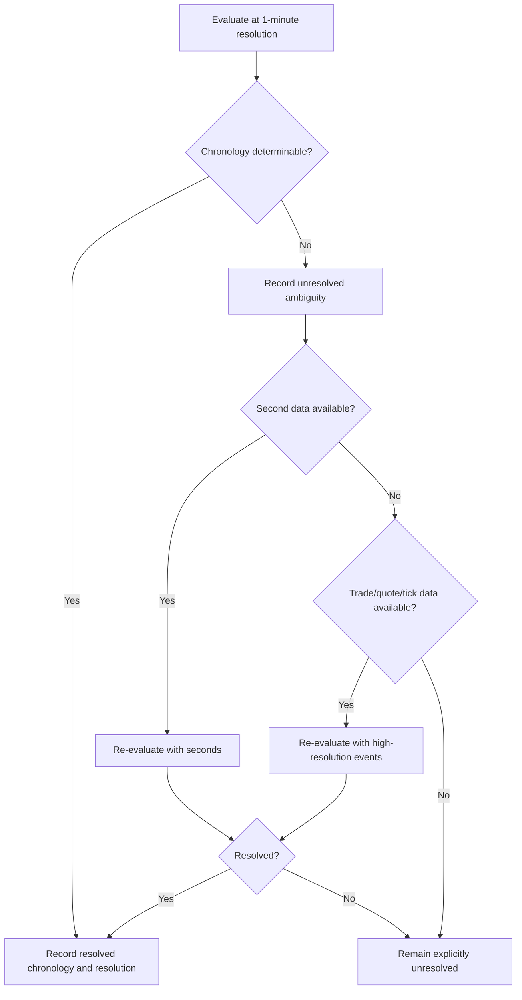

# Prop Firm Assassins Architecture V1

## 1. Document Status and Authority

Status: Architecture V1, approved design baseline pending implementation review.

This document is the source of truth for the intended architecture of Prop Firm Assassins (PFA). It governs future architectural decisions unless superseded by an explicitly versioned document. It describes target boundaries and invariants, not an authorization to implement them. The companion `PFA_MIGRATION_PLAN_V1.md` defines the additive path from the current repository.

Where this document leaves a matter open, implementations must not silently choose an answer. The decision must be recorded, versioned, and reviewed first.

## 2. PFA Mission and System Identity

PFA means **Prop Firm Assassins**. PFA is the complete trading-intelligence, research, validation, sandbox, risk/governance, and eventual execution platform. PFA is not an FVG scanner. The existing FVG Scanner is Pattern Module #1 and remains valuable proof of ingestion, persistence, reconstruction, detection, scenario modeling, feature analysis, discovery, cross-day evidence, and frozen validation.

PFA's canonical subject is the market. Scanners do not create the dataset; they annotate a continuously captured market timeline. This lets a detector invented later be replayed against history that was captured before the detector existed.

## 3. Architectural Principles

1. **The market is the dataset.** Raw and canonical market facts precede scanner output.
2. **Modularity.** Market Data, Market Intelligence, Pattern Detection, Sequence Intelligence, Research, Strategy, Evidence/Validation, Sandbox, Risk/Governance, Eventual Execution, and Observability are separate subsystems.
3. **FVG is Pattern Module #1.** Preserve its semantics through adapters and explicit engine versions.
4. **Continuous history.** Retain enough canonical information for retrospective derivation.
5. **Point-in-time safety.** A decision may use only information knowable at its decision timestamp and applicable data revision.
6. **Multi-instrument foundation.** Instrument economics and calendars replace MES constants.
7. **Intermarket context.** Other markets may describe context without automatically becoming signals.
8. **Multi-timeframe context.** Execution resolution and 1m, 5m, 15m, 1h, and higher contexts share lineage.
9. **Facts before judgment.** Market state and features describe; strategies decide.
10. **Patterns are not strategies.** Market fact, feature, pattern, sequence, strategy decision, execution, and outcome remain distinct.
11. **Sequences are first-class.** Partial, failed, overlapping, successful, and terminated sequences are retained.
12. **Outcome is richer than win/loss.** Store chronology and market response; interpret it later.
13. **Ambiguity is explicit.** Never resolve uncertain execution optimistically.
14. **Live and historical parity.** Both consume the same canonical identities, bars, sessions, provenance, corrections, and feature definitions.
15. **Evidence is staged and multidimensional.** No aggregate score alone authorizes progression.
16. **Learning does not modify production.** Discovery proposes, evidence tests, governance promotes.
17. **NO TRADE is a decision.** Abstention is measurable and may be correct.
18. **Version everything material.** Definition changes create new evidence, never silent rewrites.
19. **Preserve before replacing.** Use Adapter -> Generalize -> Migrate -> Deprecate.
20. **Incremental maturity.** Modules may be at Capture, Research, or Action maturity.

## 4. System Context

PFA receives market and contextual data, constructs canonical time-aligned facts, derives states/features/patterns/sequences, performs controlled research, and may eventually issue governed execution instructions.

```mermaid
flowchart LR
    Providers[Market and Context Providers] --> MDP[Market Data Platform]
    MDP --> Timeline[Canonical Market Timeline]
    Timeline --> Intel[Market State and Feature Engines]
    Timeline --> Patterns[Pattern Modules]
    Intel --> Patterns
    Patterns --> Sequences[Sequence Intelligence]
    Intel --> Research[Research and Learning]
    Patterns --> Research
    Sequences --> Research
    Research --> Evidence[Evidence and Validation]
    Evidence --> Registry[Versioned Strategy Registry]
    Registry --> Sandbox[Prospective Sandbox]
    Sandbox --> Governance[Risk and Governance]
    Governance --> Execution[Eventual Execution]
    Timeline --> Observability[System Observability]
    Sandbox --> Observability
    Governance --> Observability
```

## 5. Top-Level PFA Component Map

| Subsystem | Responsibility | Must not own |
|---|---|---|
| Market Data Platform | Capture, normalize, reconcile, correct, and serve market facts | Strategy judgment |
| Market Intelligence | Point-in-time market state and independent features | Trade authorization |
| Pattern Modules | Detect and lifecycle-track named behavior | Promote strategies |
| Sequence Intelligence | Relate ordered/overlapping observations and transitions | Rewrite source observations |
| Research / Learning | Generate hypotheses and analyze populations | Activate production |
| Strategy Engine | Evaluate immutable definitions and emit decisions | Override governance |
| Evidence / Validation | Cross-day, cross-market, frozen OOS, walk-forward evidence | Place orders |
| Sandbox | Prospective simulated orders, fills, positions, and performance | Read future data |
| Risk / Governance | Authorize, size, veto, suspend, and audit | Invent signals |
| Eventual Execution | Broker routing and lifecycle after authorization | Bypass governance |
| Observability | Health, quality, latency, audit, and alerting | Change research labels silently |

## 6. Canonical Market Timeline

The timeline is an ordered, queryable history keyed by canonical instrument, dated contract where applicable, event/open time, source resolution, and data version. It contains provider-neutral raw references and canonical artifacts such as bars. Derived annotations point into it; they do not replace it.

Required invariants:

- UTC instants are retained; exchange-local trading identity is separately assigned.
- Root instrument and dated contract are both known or explicitly unresolved.
- Every derived bar has input lineage, transformation version, completeness, correction state, and quality state.
- Replays declare an as-of revision so revised-state leakage can be prevented.
- Live and historical ingestion converge before consumers see data.
- Timeframe derivations are deterministic and share one definition registry.
- Missing data is represented, not silently filled.

Canonical identity should distinguish event time, bar open/close time, provider timestamp, received time, canonicalization time, and revision-effective time.

## 7. Instrument and Contract Architecture

`Instrument` represents the economic root (for example MES); `FuturesContract` represents a listed contract (for example MESU6). An instrument definition includes exchange, asset class, currency, tick size, point value, calendar/session model, price precision, and approved data resolutions. These values are effective-dated and versioned.

`ContractResolution` maps provider symbols to contracts and records resolver version and confidence. `ContinuousSeriesDefinition` describes how contract segments form a research series while retaining the original contract and price provenance. Raw contract prices must never be destroyed by continuous-series construction.

Initial research universe: MES, MNQ, Gold futures, Crude Oil futures, 10-Year Treasury futures, and EUR futures. Exact symbols and contract specifications must come from reviewed instrument definitions rather than guesses.

## 8. CME Session Architecture

A `TradingSession` must include `TradingSessionId`, `TradingDate`, `SessionOpenUtc`, `SessionCloseUtc`, exchange timezone, calendar version, holiday/early-close state, and named segments such as Overnight, pre-RTH context where applicable, Regular Morning, Midday, Regular Afternoon, and maintenance break.

Session assignment is a versioned service, not `DateTime.UtcNow.Date` or `timestamp.Date`. Features and evidence group by `TradingDate` and `TradingSessionId`. Exact CME trading-date assignment, segment boundaries, and maintenance-break representation remain open decisions.

## 9. Market Data and Provenance

Providers plug into a provider-neutral ingestion boundary. Massive is the current primary source, not a permanent architectural dependency. Tradovate and future providers expose explicit capabilities rather than appearing equivalent when functionality differs.

Every relevant artifact should carry or reference: provider, original symbol, canonical instrument, contract, source event type/resolution, source timestamp, received timestamp, source version, transformation version, correction state, quality assessment, and ingestion run.

Provider adapters may emit raw events; canonicalizers validate identity and time; timeline writers apply idempotency/correction policy; consumers subscribe to canonical artifacts only.

## 10. Data Quality

Data quality is durable research input. Quality dimensions include missing/duplicate/late events, gaps, disconnects, latency, stale feeds, incomplete sessions, invalid OHLC, unresolved contract/session, provider conflict, corrected data, and ambiguous execution.

Each research run declares eligibility rules. Unhealthy artifacts are excluded, quarantined, or explicitly included with flags; they are never silently learned from. Quality reports must be reproducible and linked to datasets.

## 11. Market State Engine

`MarketStateSnapshot` describes facts at a specific `AsOfUtc`, instrument, contract/continuous series, timeframe set, session, data revision, and engine version. Potential dimensions include trend direction/strength, volatility and volume regimes, auction/value state, liquidity state, VWAP relationship, structure, opening behavior, higher-timeframe bias, event proximity, intermarket state, and future GEX context.

Snapshots are immutable. A strategy references the snapshot it evaluated. State must not embed labels such as "good trade"; judgment belongs to strategies and evidence.

## 12. Feature Engine

Features are independently defined calculations with `FeatureDefinitionId`, version, value type/unit, input requirements, lookback, `AsOfUtc`, `KnownAtUtc`, data lineage, quality, and transformation version.

Families include price/structure; volatility; volume; value/auction; liquidity; location; time/session; pattern geometry; later order flow; and later external context. Multi-timeframe and intermarket features must preserve exact alignment and availability time. Derived features need not all be materialized permanently; materialization follows cost, reproducibility, and usage needs.

## 13. Pattern Detection Framework

A generalized pattern detector consumes a bounded point-in-time context and emits immutable `MarketPattern`/`MarketObservation` records. Contracts should express detector identity/version, supported instruments/resolutions, required inputs, detection/confirmation time, lifecycle updates, geometry payload, confidence/evidence (when meaningful), and quality requirements.

Planned modules include FVG, Liquidity Sweep, Breakout, Failed Breakout, Pullback/Continuation, Mean Reversion, Momentum Expansion, Absorption, Delta Divergence, Volume Imbalance, other order-flow patterns, and future human- or machine-defined patterns.

## 14. Existing FVG Module Position

The existing `FvgDetectionService`, `FvgTrackingService`, `CandleProcessingService`, `HistoricalFvgReplayService`, `FvgQualificationService`, `MesScenarioEngine`, feature analysis, discovery, cross-day evidence, and OOS validation remain Pattern Module #1 and its legacy research stack.

Early migration wraps these services. Existing semantics—0.50-point detection threshold, three-candle geometry, confirmation timing, entry depths, stop/target calculations, tick rounding, ambiguity, learning exclusions, and evidence gates—must be golden-master tested. Any changed semantic requires an explicit new detector/execution/feature/research version. The present `1.0.0` versus `1.1.0` code conflict must be resolved before claiming an authoritative legacy version.

## 15. Sequence Intelligence Engine

A sequence links ordered observations without mutating them. It records sequence definition/version, members and roles, transition timestamps/durations, concurrent/overlapping patterns, current stage, partial/failed/successful/terminated state, termination reason, and point-in-time confidence/evidence.

The engine must compare successful and failed paths and retain where they diverge. It supports sequences such as compression -> liquidity formation -> sweep -> failed continuation -> reclaim -> FVG -> retracement -> expansion, without assuming that this example is universal.

## 16. Universal Observation Model

An observation should contain: stable ID, observation type/schema version, detector ID/version, instrument/contract, timeframe/resolution, observed interval, detection and confirmation times, direction (optional), state snapshot reference, source timeline references, structured typed payload, lifecycle state, parent/related observations, quality, provenance, and created/version timestamps.

Generic storage must not rely only on anonymous `Value1`/`Value2`/`Value3`. Pattern-specific payloads may coexist with indexed universal fields. Observations are immutable facts; lifecycle changes are append-only revisions/events.

## 17. Universal Outcome Model

`MarketOutcome` attaches factual post-observation measurements independent of a strategy. It supports configurable future returns (including 1m, 5m, 15m, 30m, 60m), MFE/MAE, extrema, setup lifetime, interactions with VWAP/value/structure/opposing liquidity, and ordered event occurrence.

`StrategyOutcome` separately captures entry-dependent R milestones (0.5R through at least 4R), target/stop chronology, execution quality, costs, realized result, and ambiguity. Outcomes record what occurred first; strategies interpret them later. Every horizon and replay cutoff is explicit.

## 18. Entry-Window / Sequence Optimization Research

Research may evaluate multiple executable points within one sequence. It must compare probability x remaining opportunity x risk x cost x execution quality, while preventing one underlying event from masquerading as independent evidence. Results retain sequence stage, information available at entry, opportunity already consumed, and fill feasibility.

## 19. Strategy Definition Model

An immutable strategy version contains `StrategyId`, `StrategyVersion`, environment, pattern, sequence, context, and confirmation requirements; direction; entry, stop, target, management, and risk definitions; supported instruments/sessions; engine-version manifest; discovery and validation dataset references; sandbox evidence; and status. It also defines explicit abstention conditions.

## 20. Strategy Registry and Versioning

The registry stores immutable strategy versions, provenance, evidence links, approvals, author (human or machine), and lifecycle transitions. Material definition changes create a new version. Prior evidence remains attached to the version actually tested. Aliases may identify a strategy family but never obscure versions.

## 21. Research / Learning Engine

The engine generates hypotheses from point-in-time-safe features, observations, sequences, and outcomes. It records the complete search space, candidate count, filters, datasets, exclusions, engine versions, random seed where applicable, and multiple-comparison controls. It cannot promote or activate strategies.

Pipeline: Observation -> Discovery -> Cross-Day Evidence -> Cross-Market Evidence -> Frozen OOS Validation -> Walk-Forward Validation -> Sandbox -> Forward Evidence -> Promotion Review -> Small Live Pilot -> Continued Monitoring. No stage automatically skips another.

## 22. Cross-Day Evidence

Cross-day evidence matches identical immutable rule signatures across independent `TradingDate` values. It preserves sample size, distinct observations, positive/negative/flat days, expectancy, profit factor, MFE/MAE, drawdown, stability, standard deviation, regime coverage, recent behavior, and execution-adjusted results. Persistent negative evidence is retained, not discarded.

## 23. Cross-Market Evidence

Frozen hypotheses may be evaluated on related markets with compatible definitions. Results describe robustness and specificity; failure on another market is evidence, not automatic invalidation. Instrument economics, sessions, liquidity, and parameter transfer must be normalized or explicitly noncomparable.

## 24. Out-of-Sample Validation

Candidate definitions and discovery results are frozen before unseen records are loaded. Discovery and validation ranges cannot overlap. Dataset manifests prevent later correction/revision contamination unless a new validation run/version is created. Passing gates advances only to the next controlled stage; it never authorizes live trading.

## 25. Walk-Forward Validation

The engine supports rolling learn/test windows such as Jan-Mar/Apr, Feb-Apr/May, and Mar-May/Jun. Each fold freezes definitions before testing and reports stability, rediscoverability, parameter drift, regime coverage, degradation, costs, and aggregate/fold-specific results.

## 26. Execution Resolution and Ambiguity

Every result records resolution, fill model, assumptions, and ambiguity state. No optimistic target-first default is permitted. High-resolution escalation is selective around necessary windows.

## 27. Sandbox Architecture

Sandbox is prospective simulated trading on real incoming canonical data with no future access. Core entities: `SandboxAccount`, `SandboxStrategyInstance`, `SandboxSignal`, `SandboxOrder`, `SandboxFill`, `SandboxTrade`, `SandboxPosition`, and `SandboxPerformance`.

It supports commissions, slippage, latency, missed fills, and later partial fills. Multiple frozen strategies operate in isolated or explicitly shared virtual accounts. Historical expectancy/PF/drawdown/execution assumptions are compared with forward observations to detect degradation.

## 28. Risk / Governance Architecture

The strategy engine proposes; the governor authorizes or vetoes. Controls include daily loss, account drawdown, size, open risk, correlated exposure, strategy/instrument authorization, feed/latency/account health, event restrictions, emergency stop, and suspension. Decisions and reasons are durable and auditable. Validation success alone grants no execution authority.

## 29. Strategy Lifecycle

Baseline progression: Discovered -> ResearchCandidate -> CrossDayCandidate -> ValidationCandidate -> FrozenCandidate -> SandboxEligible -> SandboxActive -> LivePilotEligible -> Active. Terminal/control states include Rejected, Degraded, Suspended, and Retired. Exact names and promotion thresholds remain reviewable, but history is append-only.

## 30. NO TRADE Decision

Strategy evaluation produces a typed decision: a particular strategy action or `NO TRADE`, with timestamp, considered candidates, eligibility failures, evidence version, and reason. Abstention is included in performance and opportunity-cost analysis; absence of an exception or signal is not an adequate representation.

## 31. Order Flow Future Architecture

Order flow is a dedicated later subsystem with provider adapters, normalization, quality, and features for bid/ask volume, delta, cumulative delta, aggression, imbalance, absorption, profiles, POC/VAH/VAL, and failed aggression. Pattern modules consume its contracts rather than embedding provider-specific delta logic. Source remains undecided.

## 32. Event Awareness Future Architecture

An external-context subsystem may ingest CPI, FOMC, NFP, other scheduled releases, proximity windows, and abnormal-state flags. Events carry provider, publication/revision times, applicability, and point-in-time availability. This is not a Phase 1 blocker; provider remains undecided.

## 33. Machine-Discovered Pattern Future Architecture

Future discoveries such as `FeatureCluster_0173` are versioned hypotheses with reproducible inputs and descriptions. They receive no privileged path: the same evidence, validation, sandbox, and governance stages apply. Architecture V1 selects no ML model or framework.

## 34. Persistence / Database Domains

Logical domains are:

- Instrument, contract, continuous-series, and calendar metadata.
- Raw ingestion and provenance.
- Canonical events/bars, revisions, and quality.
- Feature definitions/values and market-state snapshots.
- Observations/patterns and lifecycle events.
- Sequences, members, and transitions.
- Outcomes and chronology.
- Dataset manifests, experiments, hypotheses, and evidence.
- Strategy registry and lifecycle.
- Sandbox accounts/orders/fills/positions/performance.
- Governance decisions and execution audit.
- Operational metrics and incidents.

SQLite may remain during additive migration, but domain boundaries must not depend on SQLite. The existing database is potentially valuable: inventory, back up, migrate additively, verify counts/hashes, and retain rollback. Existing tables are not presumed disposable.

## 35. Engine Versioning and Reproducibility

Every result carries a manifest containing at least DataVersion, FeatureEngineVersion, PatternDetectorVersion, SequenceEngineVersion, StrategyEngineVersion, ExecutionModelVersion, ResearchEngineVersion, SessionModelVersion, and ContractResolverVersion. It also identifies code/build, parameters, dataset, quality policy, and generation time. Recalculation creates new results; it does not overwrite prior evidence.

## 36. Observability / System Health

Measure provider latency/reconnects/staleness, missing and duplicate bars, rejected/corrected events, unresolved identities/sessions, detector/sequence counts, ambiguous outcomes, database failures, strategy latency, sandbox order latency, and governance vetoes. Health context must be linkable to research and sandbox records.

## 37. Security / Secrets / External Connections

Secrets remain outside source control and must not appear in query/log output. Provider clients use least privilege, explicit environments, timeout/retry/rate-limit policy, secret rotation, and audited connection state. Research APIs and future mutation/execution APIs require distinct authorization; execution credentials must not be available to research-only components.

## 38. API Compatibility

Existing controller routes remain backward compatible where practical. New generalized APIs are additive and versioned. Legacy controllers call adapters into new services during migration. Breaking changes require an announced deprecation period, compatibility tests, and explicit cutover; template/experimental endpoints may be removed only through a reviewed API decision.

## 39. Concurrency / State Management

Durable state is authoritative. In-memory state is bounded, partitioned by canonical instrument/contract/timeframe, and reconstructable. Services declare concurrency ownership; mutable singletons require synchronization or replacement with actors/queues/partition workers. Writes are idempotent, ordering assumptions explicit, cancellation observed, and background tasks supervised. Multi-instrument processing must prevent one stream from blocking or corrupting another.

## 40. Automated Testing Strategy

Before major refactoring, add unit, integration, concurrency, API compatibility, and golden-master replay tests. Priority coverage includes FVG detection; candle aggregation; historical replay; R/stop/target chronology; ambiguous candles; entry models; MES conversion; fixed-risk normalization; discovery; cross-day matching and persistent negatives; frozen immutability; date separation; gates and `CanActivateStrategy`; database idempotency/provider conflict; sessions/weekends/maintenance; rollover; singleton concurrency; and known historical replay days.

Every migration phase adds parity tests. Live/canonical and historical/canonical pipelines must pass identical-artifact tests.

## 41. Bias / Overfitting Controls

Controls address look-ahead, future and revised-state leakage, validation contamination, selection/survivorship bias, multiple hypotheses, parameter mining, regime concentration, and instability. Required mechanisms include immutable datasets, temporal splits, searchable hypothesis logs, independent-event counting, search-space disclosure, minimum samples, sensitivity/stability analysis, frozen definitions, walk-forward folds, negative-result retention, and human/governance review.

## 42. Data Retention / Storage Tiers

1. **Tier 1 — Canonical Market Data:** enough raw and canonical data, provenance, revisions, calendars, and contracts to reconstruct research.
2. **Tier 2 — Derived Features:** versioned, reproducible feature values and snapshots, materialized selectively.
3. **Tier 3 — Patterns, Sequences, and Research Observations:** higher-level annotations, outcomes, hypotheses, and evidence.
4. **Tier 4 — High-Resolution Escalation:** second, trade, quote, or tick windows retained where ambiguity or specialized research justifies cost.

Retention policies must protect reproducibility while managing cost. Derived data may be recomputable only when source data and exact engine versions remain available.

## 43. Research Universe vs Strategy Universe vs Execution Universe

- **Research Universe:** instruments PFA may capture and analyze.
- **Strategy Universe:** instruments a particular immutable strategy version supports based on evidence.
- **Authorized Execution Universe:** strategy/instrument/account combinations explicitly approved by governance.

Membership never flows automatically between universes. MES, MNQ, Gold, Crude Oil, 10-Year Treasury, and EUR futures begin as intended research candidates, not execution authorizations.

## 44. Non-Goals for Initial Migration

Initial migration will not implement every detector, ML, order flow, event/GEX integration, broker execution, production risk governor, distributed database, or final fill model. It will not discard SQLite history, rewrite proven FVG behavior, silently normalize historical evidence to new semantics, or break APIs without adapters. Capturing common market foundations takes priority over prematurely completing every Action-level module.

## 45. Open Architectural Decisions

The following remain explicitly unresolved:

- Exact CME trading-date assignment and session segment definitions.
- Exact maintenance-break representation.
- Contract rollover methodology.
- Adjusted versus unadjusted continuous prices (or support for both).
- Long-term provider reconciliation and source-priority policy.
- Final canonical bar correction/revision policy.
- Sandbox fill methodology, commissions, slippage, and latency assumptions.
- Portfolio treatment of overlapping and correlated signals.
- Exact promotion thresholds and which are configurable versus governance policy.
- Authoritative current FVG engine version given `1.0.0`/`1.1.0` conflicts.
- Historical replay horizon and session-boundary rules.
- Event-data provider.
- Order-flow source.
- Future GEX source and methodology.
- Long-term persistence technology and archival format.

## 46. Definition of Done for Architecture V1

Architecture V1 is complete when:

- These boundaries and invariants are accepted as the development source of truth.
- The companion migration plan maps them to the actual repository.
- All open decisions remain visible rather than embedded as accidental defaults.
- Phase 0 golden-master scope is approved before behavioral refactoring.
- Every implementation change can identify its subsystem, version impact, data/API impact, tests, rollback point, and governance implications.
- PFA is consistently described and designed as the full platform, with FVG retained as Pattern Module #1.

