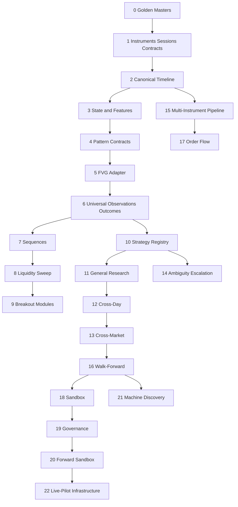

# Prop Firm Assassins Migration Plan V1

## 1. Status, Scope, and Migration Rules

This plan maps `PFA_ARCHITECTURE_V1.md` onto the current single-project ASP.NET Core repository. It authorizes no application change by itself. Each phase requires separate review and implementation authorization.

The governing method is **Adapter -> Generalize -> Migrate -> Deprecate**, never delete-first rewriting. Each phase is independently releasable and reversible. Existing routes and FVG results remain operational until parity, migration verification, and explicit deprecation approval exist.

Current repository anchors:

- Entry/DI: `PFA FVG Scanner/Program.cs`
- Providers: `MarketData/IMarketDataProvider.cs`, Massive, Tradovate, and simulated implementations
- Persistence: `Data/PfaDatabase.cs` and four repositories
- Candle path: `MarketDataPipelineService`, `FiveMinuteCandleAggregator`, `HistoricalCandleRebuildService`
- FVG stack: detection, tracking, processing, qualification, replay, scenario, features, discovery, cross-day evidence, OOS validation
- API: current controllers under `Controllers/`
- Runtime: .NET 10, SQLite, one web project, no automated test project

For every database phase: back up the existing SQLite file, inventory row counts/schema/indexes, use additive versioned migrations, verify old and new reads, and retain the prior file as rollback. Exact new filenames below are likely design targets, not pre-approved implementation names.

## 2. Phase Dependency Map

## 3. Common Phase Controls

Every phase must record goal, repository touch points, preserved/wrapped/generalized/new files, database/API effects, before/after tests, rollback, definition of done, and risk. No phase may silently change current FVG semantics. Any behavior difference requires explicit versioning and side-by-side evidence.

## 4. Phase 0 — Regression Protection / Golden Masters

- **Goal:** Freeze current working behavior before structural change.
- **Existing files involved:** all current services/models/repositories/controllers, especially `FvgDetectionService.cs`, `FiveMinuteCandleAggregator.cs`, `HistoricalFvgReplayService.cs`, `MesScenarioEngine.cs`, feature/discovery/evidence/validation services, and `PfaDatabase.cs`.
- **Preserve unchanged:** all production C# and database behavior.
- **Wrap/adapt:** none.
- **Eventually generalize:** none in this phase.
- **Likely new files:** a test project; curated input fixtures; serialized golden outputs; test database factory.
- **Database impact:** none; use copied disposable test databases only.
- **API impact:** none; capture response-contract baselines.
- **Tests before:** current build plus manual known-day replay inventory.
- **Tests after:** detection, aggregation, replay, entry/stop/target/R, ambiguity, MES dollars, fixed-risk, discovery, cross-day, persistent-negative, freeze/date separation/gates/nonactivation, idempotency/provider conflicts/concurrency; several known historical days.
- **Rollback:** remove the additive test project/fixtures; production remains untouched.
- **Done:** reproducible golden masters pass and document the `1.0.0`/`1.1.0` discrepancy without resolving it accidentally.
- **Risks:** unstable IDs/timestamps or oversized HTTP snapshots; sanitize nondeterministic fields rather than weakening assertions.

## 5. Phase 1 — Canonical Trading Session, Instrument, and Contract Foundation

- **Goal:** Replace implicit MES/UTC-date assumptions with additive versioned definitions.
- **Existing files involved:** `Candle.cs`, `MassiveOptions.cs`, `TradovateOptions.cs.cs`, `MassiveContractsController.cs`, watchdog, MES normalization/scenario services, FVG feature session bucketing.
- **Preserve unchanged:** FVG detection/replay/scenario algorithms and existing endpoint responses.
- **Wrap/adapt:** ticker strings through instrument/contract resolvers; legacy UTC session buckets through a compatibility session adapter.
- **Eventually generalize:** MES constants, controller-based contract lookup, UTC-hour session bucketing.
- **Likely new files:** `Domain/Instruments/*`, `Domain/Sessions/*`, resolver interfaces, in-memory/bootstrap definitions, repositories, version records.
- **Database impact:** additive instrument, contract, provider-symbol mapping, session-calendar/version tables; no rewrite of `Candles`.
- **API impact:** additive instrument/contract/session endpoints; old Massive contract endpoint remains.
- **Tests before:** Phase 0; capture current MES tick/dollar/session outputs.
- **Tests after:** MES/MNQ/Gold/Crude/10Y/EUR specifications; DST, weekends, holidays, early closes, maintenance; contract resolution/roll boundaries.
- **Rollback:** disable new resolvers and retain string-based paths/tables.
- **Done:** all new components consume canonical IDs while legacy FVG receives equivalent MES values through adapters.
- **Risks/open decisions:** trading-date rules, maintenance representation, rollover, adjusted/unadjusted series.

## 6. Phase 2 — Canonical Market Timeline / Provenance Convergence

- **Goal:** Make live and historical consumers see the same canonical artifacts.
- **Existing files involved:** `IMarketDataProvider.cs`, all providers, `MassiveBackfillService.cs`, `RawMarketEventRepository.cs`, `CandleRepository.cs`, `MarketDataPipelineService.cs`, `MarketDataGapService.cs`, watchdog, aggregator/rebuild services.
- **Preserve unchanged:** provider wire parsing and raw payload retention where correct; legacy repository/API reads.
- **Wrap/adapt:** providers into normalized event envelopes; legacy `Candle` into canonical bars; existing repositories behind compatibility readers/writers.
- **Eventually generalize:** hard-coded live 1m->5m emission, `INSERT OR IGNORE` correction behavior, provider-in-identity ambiguity, wall-clock gap expectations.
- **Likely new files:** canonical event/bar/provenance/quality models; timeline repository; timeframe builder; ingestion run and correction services; provider capability contracts.
- **Database impact:** additive canonical timeline, lineage, revision, ingestion-run, and quality records. Backfill current data with provenance links; never destroy raw rows.
- **API impact:** additive timeline/quality endpoints; current market-data/database endpoints remain compatible.
- **Tests before:** raw/candle idempotency, live/historical fixture capture, incomplete bucket tests.
- **Tests after:** identical canonical bars from equivalent live/backfill inputs, corrections, duplicates, gaps, provider conflicts, restart/replay, session-aware expected bars.
- **Rollback:** dual-write feature flag off; old tables and pipeline remain authoritative.
- **Done:** historical and live paths converge before analysis and every canonical bar has contract/session/provenance/quality/version.
- **Risks:** duplicate history, incorrect timestamp interpretation, corrections changing evidence, backfill pagination.

## 7. Phase 3 — Market State and Universal Feature Foundation

- **Goal:** Produce point-in-time facts independent of strategy judgment.
- **Existing files involved:** `FvgFeatureRecord.cs`, `FvgFeatureAnalysisService.cs`, candle/rebuild services.
- **Preserve unchanged:** existing FVG feature outputs and discovery inputs.
- **Wrap/adapt:** map legacy FVG records to feature definitions; expose legacy session/gap/risk buckets as versioned definitions.
- **Eventually generalize:** FVG-only feature record and embedded MES/session constants.
- **Likely new files:** feature definition/value contracts, `MarketStateSnapshot`, feature/state engines, availability/lineage validators.
- **Database impact:** additive feature definitions/values and state snapshots with `AsOfUtc`, `KnownAtUtc`, engine/data versions.
- **API impact:** additive feature/state queries; no old response changes.
- **Tests before:** golden FVG records and population exclusions.
- **Tests after:** point-in-time availability, multi-timeframe alignment, intermarket clock alignment, deterministic recomputation, quality propagation.
- **Rollback:** stop dual production; legacy feature service remains.
- **Done:** strategy-neutral features and snapshots are reproducible without altering FVG research.
- **Risks:** leakage, excessive materialization, misaligned cross-market clocks.

## 8. Phase 4 — Generalized MarketPattern Contracts

- **Goal:** Define module boundaries before adding detectors.
- **Existing files involved:** `FairValueGap.cs`, detection, tracking, processing, observation repository.
- **Preserve unchanged:** legacy models and services.
- **Wrap/adapt:** no algorithm changes; create contracts around inputs/outputs/lifecycle.
- **Eventually generalize:** scanner-specific orchestration and direct FVG persistence.
- **Likely new files:** `Patterns/IMarketPatternDetector`, context/result/lifecycle/version contracts, module registry.
- **Database impact:** none beyond optional module-definition metadata.
- **API impact:** additive module inventory/diagnostics.
- **Tests before:** FVG golden masters.
- **Tests after:** contract conformance, deterministic IDs, supported-resolution and quality rejection.
- **Rollback:** leave contracts unused.
- **Done:** a second detector can implement contracts without depending on FVG types.
- **Risks:** overly abstract contracts; avoid forcing all geometry into anonymous values.

## 9. Phase 5 — Wrap Existing FVG System as Pattern Module #1

- **Goal:** Integrate FVG without rewriting it.
- **Existing files involved:** all `Fvg*` services/models/controllers plus `CandleProcessingService`, `Mes*`, and historical rebuild.
- **Preserve unchanged:** core detection, replay, scenario, feature, discovery, evidence, and validation algorithms initially.
- **Wrap/adapt:** canonical bars to `Candle`; `FairValueGap` to universal pattern; legacy outputs to new contracts; legacy routes to the adapter.
- **Eventually generalize:** direct `Mes` and `Fvg` dependencies outside the module.
- **Likely new files:** `Patterns/Fvg/FvgPatternModule`, mappers, compatibility facade, version manifest.
- **Database impact:** dual-write universal observation references without deleting legacy observations.
- **API impact:** old FVG endpoints remain; additive generalized pattern endpoints.
- **Tests before:** full Phase 0 suite.
- **Tests after:** old-vs-adapter parity for IDs, counts, geometry, outcomes, scenarios, candidate/evidence statuses.
- **Rollback:** disable adapter/dual-write.
- **Done:** FVG is discoverable as Pattern Module #1 and produces unchanged legacy evidence.
- **Risks:** engine-version conflict; no semantic change until authoritative legacy version is decided.

## 10. Phase 6 — Universal MarketObservation and MarketOutcome

- **Goal:** Store factual observations/outcomes beyond FVG and beyond win/loss.
- **Existing files involved:** `ObservationRepository.cs`, `FvgOutcomeRepository.cs`, `PfaDatabase.cs`, `FairValueGap.cs`, `FvgOutcome.cs`, `FvgTradeQualification.cs`.
- **Preserve unchanged:** legacy tables/readers during dual operation.
- **Wrap/adapt:** map FVG observation/outcome fields and chronology to universal records.
- **Eventually generalize:** `Value1-3`, FVG-specific outcome columns, inactive `Setups` relationship.
- **Likely new files:** observation/outcome/lifecycle/relationship repositories and typed payload schemas.
- **Database impact:** additive normalized identities, observation revisions, outcome metrics/events, lineage, quality, state links. Verify foreign-key policy and current orphan risk.
- **API impact:** additive universal endpoints; legacy DTOs remain.
- **Tests before:** database backup, counts, deterministic FVG identity, outcome serialization.
- **Tests after:** dual-read/write parity, configurable horizons, first-event chronology, MFE/MAE, immutable lifecycle, migration count/hash checks.
- **Rollback:** retain legacy writes as authority and discard unpromoted additive tables.
- **Done:** FVG and future modules share universal facts without losing module payloads.
- **Risks:** lossy mapping, duplicate IDs, huge JSON payloads, accidental history rewrite.

## 11. Phase 7 — Sequence Intelligence Foundation

- **Goal:** Persist ordered, overlapping, partial, failed, successful, and terminated behavior sequences.
- **Existing files involved:** universal observations/outcomes from Phase 6; historical pipeline.
- **Preserve unchanged:** pattern modules and outcomes.
- **Wrap/adapt:** observation event stream into sequence contexts.
- **Eventually generalize:** none of the legacy FVG algorithms.
- **Likely new files:** sequence definition/instance/member/transition/state contracts, engine, repository.
- **Database impact:** additive sequence tables and immutable transition history.
- **API impact:** additive sequence research endpoints.
- **Tests before:** observation chronology and session identity.
- **Tests after:** overlaps, timeouts, partial/failure/success paths, termination, replay determinism, point-in-time confidence.
- **Rollback:** sequences are removable derived annotations.
- **Done:** sequences replay deterministically without mutating observations.
- **Risks:** combinatorial state growth and accidental hindsight labels.

## 12. Phase 8 — Liquidity Sweep Pattern Module

- **Goal:** Prove the generalized framework with Pattern Module #2.
- **Existing files involved:** canonical timeline, features/state, pattern contracts, observation/outcome services.
- **Preserve unchanged:** FVG module.
- **Wrap/adapt:** reusable swing/prior-high-low features only.
- **Eventually generalize:** any sweep-specific logic discovered to be common after evidence, not before.
- **Likely new files:** liquidity-sweep definition, detector, lifecycle, payload, tests.
- **Database impact:** universal observations/outcomes only; no scanner-specific core schema.
- **API impact:** generalized pattern endpoints should suffice; optional compatibility research route.
- **Tests before:** framework conformance and known market fixtures.
- **Tests after:** bullish/bearish sweeps, equal levels, depth, failures, gaps/sessions, golden days.
- **Rollback:** disable module registration; canonical data remains.
- **Done:** historical and live canonical inputs yield equivalent sweep observations at Capture/Research maturity.
- **Risks:** premature definition and look-ahead swing confirmation.

## 13. Phase 9 — Breakout / Failed Breakout Pattern Modules

- **Goal:** Add related but distinct modules and demonstrate composition.
- **Existing files involved:** Phase 8 foundations and sequence engine.
- **Preserve unchanged:** FVG and sweep modules.
- **Wrap/adapt:** common structure/range features.
- **Eventually generalize:** shared level/reference contracts based on demonstrated overlap.
- **Likely new files:** breakout and failed-breakout modules/payloads/tests.
- **Database impact:** universal records only.
- **API impact:** additive module metadata if needed.
- **Tests before/after:** point-in-time range formation, break/close/reclaim semantics, failures, overlap with sweeps, replay/live parity.
- **Rollback:** disable either module independently.
- **Done:** both patterns coexist and can form sequences without being strategies.
- **Risks:** circular definitions and success-only labeling.

## 14. Phase 10 — Generalized Strategy Definition and Registry

- **Goal:** Create immutable, versioned strategy definitions separate from patterns.
- **Existing files involved:** `MesTradeScenario.cs`, candidate/frozen models, scenario and validation services, existing `Experiments` table.
- **Preserve unchanged:** MES scenario engine and frozen FVG candidate behavior.
- **Wrap/adapt:** frozen candidate into a strategy-version compatibility representation.
- **Eventually generalize:** entry/stop/target/risk assumptions and unused experiment schema.
- **Likely new files:** strategy definition/version/manifest/status/registry/decision contracts.
- **Database impact:** additive strategy family/version, requirements, datasets, evidence links, lifecycle events.
- **API impact:** additive registry endpoints; no activation endpoint.
- **Tests before:** frozen-candidate immutability and nonactivation.
- **Tests after:** material-change versioning, immutable reads, manifest completeness, `NO TRADE`, unauthorized status protection.
- **Rollback:** registry remains unused; frozen FVG path continues.
- **Done:** definitions can be frozen and audited but cannot self-promote.
- **Risks:** conflating candidates with approved strategies.

## 15. Phase 11 — Generalized Research / Candidate Discovery

- **Goal:** Generalize hypothesis generation while preserving FVG discovery.
- **Existing files involved:** `FvgFeatureAnalysisService.cs`, `FvgCandidateRuleDiscoveryService.cs`, `FvgFeatureRecord.cs`, `FvgCandidateRule.cs`, research controller.
- **Preserve unchanged:** legacy candidate matrix, score, statuses, sample threshold.
- **Wrap/adapt:** FVG feature population/candidates into generalized experiment/hypothesis records.
- **Eventually generalize:** feature-specific filter fields and FVG naming.
- **Likely new files:** experiment manifest, search-space, hypothesis, population, evidence metric services.
- **Database impact:** persist runs, datasets, exclusions, tested candidates (including negative/empty summary), engine versions.
- **API impact:** additive asynchronous/reproducible research-run APIs; legacy summary remains.
- **Tests before:** current candidate count/signatures/ranking and population exclusions.
- **Tests after:** deterministic search, independent-event counting, search-space audit, multiple-comparison metadata, negative retention.
- **Rollback:** use legacy discovery outputs.
- **Done:** FVG results match while non-FVG hypotheses can use the same framework.
- **Risks:** best-of-thousands promotion and accidental changed rankings.

## 16. Phase 12 — Generalized Cross-Day Evidence

- **Goal:** Apply persistence analysis to immutable strategy signatures and real trading dates.
- **Existing files involved:** `FvgCrossDayEvidenceService.cs`, `CrossDayEvidenceController.cs`.
- **Preserve unchanged:** FVG gates/status logic under its legacy version.
- **Wrap/adapt:** rule signature and daily results; UTC dates through session compatibility mapping.
- **Eventually generalize:** FVG-specific DTOs and calendar-day grouping.
- **Likely new files:** generalized cross-day report, signature, stability service, repository.
- **Database impact:** durable daily evidence and metric dimensions.
- **API impact:** additive evidence APIs; old route preserved.
- **Tests before:** matching, persistent candidate/watchlist/negative/unstable/insufficient classifications.
- **Tests after:** session trading dates, missing days, regime coverage, immutable aggregated metrics, FVG parity.
- **Rollback:** use existing service.
- **Done:** identical definitions match across independent sessions with no automatic activation.
- **Risks:** summing nonindependent observations and calendar migration differences.

## 17. Phase 13 — Cross-Market Evidence

- **Goal:** Measure hypothesis specificity and robustness across compatible instruments.
- **Existing files involved:** generalized evidence, instrument specs, strategy registry, multi-instrument features.
- **Preserve unchanged:** single-market evidence.
- **Wrap/adapt:** normalized units and compatible definitions.
- **Eventually generalize:** none of the legacy FVG path until parity exists.
- **Likely new files:** cross-market plan/result/comparability services.
- **Database impact:** evidence by instrument and comparability notes.
- **API impact:** additive endpoints.
- **Tests before/after:** tick/point normalization, session differences, unavailable features, specificity classification, no automatic invalidation.
- **Rollback:** omit cross-market evidence from progression.
- **Done:** frozen hypotheses produce auditable per-market and aggregate evidence.
- **Risks:** false equivalence across market microstructures.

## 18. Phase 14 — Execution Ambiguity Resolution Escalation

- **Goal:** Escalate unresolved 1m chronology conservatively.
- **Existing files involved:** `MesScenarioEngine.cs`, `MesExecutionNormalizationService.cs`, `HistoricalFvgReplayService.cs`, raw/canonical data services.
- **Preserve unchanged:** current ambiguous classification and no-realized-P&L behavior.
- **Wrap/adapt:** scenario engine into resolution-aware evaluator.
- **Eventually generalize:** MES-only prices/costs and single-resolution replay.
- **Likely new files:** execution evidence request/resolver, resolution hierarchy, fill-model manifest.
- **Database impact:** ambiguity cases, requested windows, higher-resolution lineage, resolution result.
- **API impact:** additive diagnostics/reprocessing.
- **Tests before:** every ambiguous target/stop/entry-candle case.
- **Tests after:** second/tick escalation, still-unresolved retention, no optimistic fallback, exact lineage.
- **Rollback:** retain legacy ambiguity result.
- **Done:** resolution can improve only with evidence and records the method used.
- **Risks/open decisions:** data availability, fill methodology, costs, slippage, latency.

## 19. Phase 15 — Automated Multi-Instrument Historical Pipeline

- **Goal:** Run canonical capture/rebuild/research across the intended research universe.
- **Existing files involved:** Massive backfill/gap/rebuild controllers/services and repositories.
- **Preserve unchanged:** existing manual endpoints and strict complete-bucket behavior.
- **Wrap/adapt:** services as idempotent jobs using instrument/session/timeline abstractions.
- **Eventually generalize:** 50,000-row one-shot backfill, fixed 5m rebuild, large synchronous HTTP results.
- **Likely new files:** job/run/checkpoint/scheduler contracts, universe planner, retry/resume, dataset manifest.
- **Database impact:** job/checkpoint/run/coverage records; no destructive candle migration.
- **API impact:** additive job submission/status; compatibility endpoints remain.
- **Tests before:** provider limits, gap and rebuild golden tests.
- **Tests after:** pagination, resume, idempotency, isolation, session-aware coverage, multi-instrument concurrency.
- **Rollback:** stop jobs and continue manual paths.
- **Done:** reproducible datasets can be built for each research instrument with quality reports.
- **Risks:** provider limits/cost, SQLite contention, bad rollover/session definitions.

## 20. Phase 16 — Walk-Forward Validation

- **Goal:** Test rediscoverability and performance through rolling unseen windows.
- **Existing files involved:** `FvgOutOfSampleValidationService.cs`, validation controller, generalized research/evidence/registry.
- **Preserve unchanged:** frozen-candidate gates and permanent `CanActivateStrategy=false` behavior.
- **Wrap/adapt:** legacy validator as a single-fold implementation/reference.
- **Eventually generalize:** FVG-only frozen/report types.
- **Likely new files:** fold plan, dataset partition validator, fold/aggregate results, stability/degradation services.
- **Database impact:** immutable fold definitions/results and dataset hashes.
- **API impact:** additive run/status/report endpoints.
- **Tests before:** date separation, freeze, gates, drawdown/stability.
- **Tests after:** rolling windows, no overlap, correction revision isolation, fold aggregation, parameter drift.
- **Rollback:** retain frozen OOS stage without walk-forward promotion.
- **Done:** strategy versions cannot advance without required fold evidence.
- **Risks:** contamination, insufficient regimes, hidden re-selection between folds.

## 21. Phase 17 — Order-Flow Subsystem

- **Goal:** Add dedicated order-flow capture and features without polluting detectors.
- **Existing files involved:** provider/timeline/provenance/feature contracts.
- **Preserve unchanged:** candle-based modules.
- **Wrap/adapt:** provider-specific trades/quotes into order-flow events.
- **Eventually generalize:** none until a source is selected.
- **Likely new files:** order-flow events, aggregation/profile/delta engines, quality checks.
- **Database impact:** separate high-volume storage domain and retention policy.
- **API impact:** additive diagnostics/research APIs.
- **Tests before/after:** ordering, aggressor classification, duplicates/corrections, profile boundaries, point-in-time safety.
- **Rollback:** disable subsystem; candle research continues.
- **Done:** order-flow features are versioned inputs, not scattered calculations.
- **Risks/open decisions:** exact source, volume/cost, provider semantics.

## 22. Phase 18 — Sandbox Infrastructure

- **Goal:** Prospectively simulate frozen strategies against live canonical data.
- **Existing files involved:** simulated provider, market pipeline, scenario concepts, strategy registry.
- **Preserve unchanged:** `SimulatedMarketDataProvider` as a test utility and historical scenario engines.
- **Wrap/adapt:** strategy decisions into sandbox signals; instrument economics into fill/risk calculations.
- **Eventually generalize:** manual candle publication and MES scenario-only capital model.
- **Likely new files:** sandbox account/instance/signal/order/fill/trade/position/performance, clock, broker simulator.
- **Database impact:** durable append-only sandbox ledger.
- **API impact:** authenticated additive sandbox control/read APIs.
- **Tests before:** registry immutability and canonical live parity.
- **Tests after:** no-future clock, order lifecycle, missed/partial fills, costs, restart recovery, account isolation.
- **Rollback:** stop sandbox instances; historical research unaffected.
- **Done:** multiple frozen versions run prospectively in virtual accounts with auditable results.
- **Risks/open decisions:** fill, commissions, slippage, latency, overlap/portfolio behavior.

## 23. Phase 19 — Risk / Governance

- **Goal:** Separate proposal from authorization and veto.
- **Existing files involved:** validation nonactivation protections, strategy registry, sandbox.
- **Preserve unchanged:** all `CanActivateStrategy=false` safeguards.
- **Wrap/adapt:** sandbox orders through a governor before acceptance.
- **Eventually generalize:** hard-coded promotion gates into versioned evidence policy versus nonconfigurable governance policy.
- **Likely new files:** policies, authorization/veto decisions, limits, emergency stop, approvals, audit repository.
- **Database impact:** policy versions, approvals, decisions, suspensions, incidents.
- **API impact:** strongly authorized governance APIs separate from research.
- **Tests before/after:** every veto, stale feed/latency/account health, loss/drawdown/open-risk/correlation limits, emergency stop, immutable audit.
- **Rollback:** deny all action and keep research/sandbox read-only.
- **Done:** no sandbox/action request bypasses governance.
- **Risks:** unsafe defaults; default must be deny when evidence/health/authorization is missing.

## 24. Phase 20 — Forward Sandbox Operation

- **Goal:** Operate sandbox continuously and compare forward reality with historical expectations.
- **Existing files involved:** watchdog/health, canonical live pipeline, sandbox, evidence.
- **Preserve unchanged:** historical results.
- **Wrap/adapt:** health telemetry and forward evidence into degradation monitors.
- **Eventually generalize:** current Massive-specific watchdog.
- **Likely new files:** forward campaign, expectation comparator, degradation/suspension rules.
- **Database impact:** campaigns, daily snapshots, comparisons, incidents.
- **API impact:** dashboards/read APIs and governed start/stop.
- **Tests before/after:** reconnect/session closures, restart recovery, historical-vs-forward metrics, degradation alerts, automatic safe suspension.
- **Rollback:** stop campaigns; keep ledger/evidence.
- **Done:** forward evidence accumulates without future leakage and never self-promotes.
- **Risks:** operational gaps mistaken for strategy degradation or vice versa.

## 25. Phase 21 — Machine-Discovered Behavior Research

- **Goal:** Permit unnamed feature/sequence hypotheses under the normal evidence pipeline.
- **Existing files involved:** universal features/sequences/research/evidence registry.
- **Preserve unchanged:** human-defined modules and all gates.
- **Wrap/adapt:** machine output into ordinary versioned hypotheses.
- **Eventually generalize:** none; do not choose an ML framework prematurely.
- **Likely new files:** discovery-run manifest, cluster/hypothesis representation, explainability and reproducibility metadata.
- **Database impact:** model/run/version/search metadata and hypotheses.
- **API impact:** research-only APIs; no activation capability.
- **Tests before/after:** temporal splits, seeds/reproducibility, leakage, multiple comparisons, same-stage enforcement.
- **Rollback:** disable machine discovery; retain hypotheses/evidence.
- **Done:** `FeatureCluster_*` hypotheses have no privileged promotion path.
- **Risks:** opaque leakage, parameter mining, irreproducibility.

## 26. Phase 22 — Live-Pilot Infrastructure

- **Goal:** Build—not automatically enable—the infrastructure for a tightly governed small live pilot only after approved evidence and forward sandbox operation.
- **Existing files involved:** future execution adapter, registry, sandbox parity, governance, observability; current providers are market-data providers, not broker execution authorization.
- **Preserve unchanged:** research, evidence, sandbox ledgers, and deny-by-default rules.
- **Wrap/adapt:** authorized strategy decisions through governance to broker-neutral order contracts.
- **Eventually generalize:** no current file should be repurposed as live execution without explicit design.
- **Likely new files:** execution provider contract, order router, reconciliation, account state, kill switch, immutable audit.
- **Database impact:** separate live order/fill/reconciliation ledger with strict access controls.
- **API impact:** separately authenticated/authorized operational APIs; no reuse of public research mutation endpoints.
- **Tests before:** approved evidence, sandbox parity, failure drills, credential separation, governance verification.
- **Tests after:** paper/broker certification, duplicate-order prevention, reconnect/reconciliation, kill switch, partial/rejected fills, audit completeness.
- **Rollback:** revoke authorization/credentials and return strategy to SandboxActive or Suspended.
- **Done:** infrastructure remains inert until a separately recorded human/governance approval authorizes a bounded pilot.
- **Risks:** capital loss, duplicate orders, stale state, credential exposure, governance bypass. This phase requires a separate high-stakes design review.

## 27. Cross-Phase API and Database Compatibility

New domains should be additive and dual-read/dual-write only when parity can be measured. Existing controllers—market data, database, diagnostics, backfill/gaps/rebuild, candles/FVG/qualification, research, cross-day, and validation—remain compatible during migration. Compatibility facades translate new domain results into existing DTOs. Deprecation requires usage evidence, published replacement, tests, and explicit approval.

Database changes require backup, migration journal, row-count/hash reconciliation, referential-integrity checks, and restoration rehearsal. Current `RawMarketEvents`, `Candles`, `Observations`, `Setups`, `Outcomes`, and `Experiments` are preserved until their historical value and replacement mapping are proven.

## 28. Open Decisions and Phase Gates

No phase may silently settle: CME trading-date assignment; maintenance representation; rollover; adjusted/unadjusted series; provider reconciliation; bar corrections; sandbox fills; commissions/slippage/latency; overlapping-signal portfolios; promotion thresholds and policy ownership; FVG `1.0.0` versus `1.1.0`; replay horizon; event provider; order-flow source; or GEX source/method.

The relevant phase must produce a decision record and testable versioned definition before relying on the answer. Until then, compatibility behavior remains explicit and research cannot be promoted on the unresolved semantic.

## 29. Program-Level Definition of Done

The migration is complete only when:

- Canonical market history, not scanner output, is the durable research foundation.
- Live and historical paths produce equivalent versioned artifacts.
- Instruments, contracts, sessions, provenance, quality, and corrections are explicit.
- FVG remains operational as Pattern Module #1 with traceable versioned evidence.
- Additional modules and sequences use universal contracts.
- Strategies and evidence are immutable, reproducible, and staged.
- Sandbox is prospective and ambiguity/cost aware.
- Governance is independent, deny-by-default, and auditable.
- `NO TRADE` is first-class.
- No live capability can activate from validation alone.
- Existing API and database history have either compatible support or an explicitly approved, verified deprecation path.

